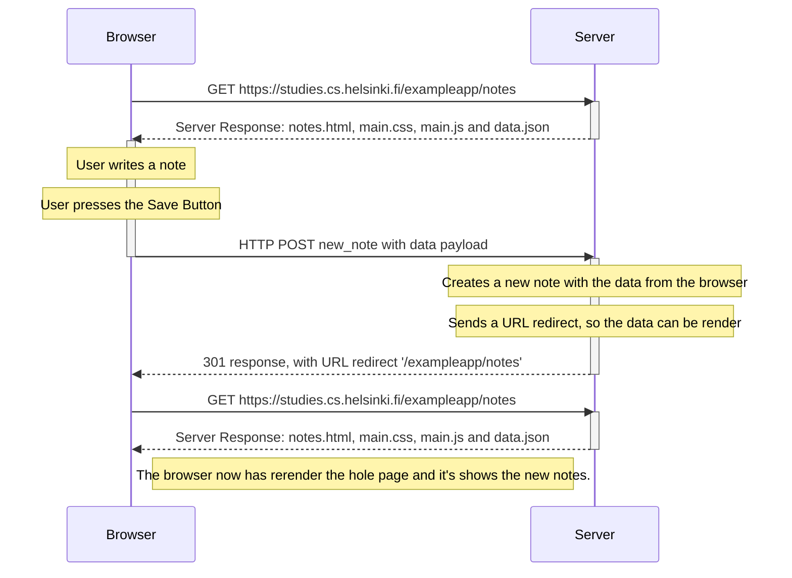
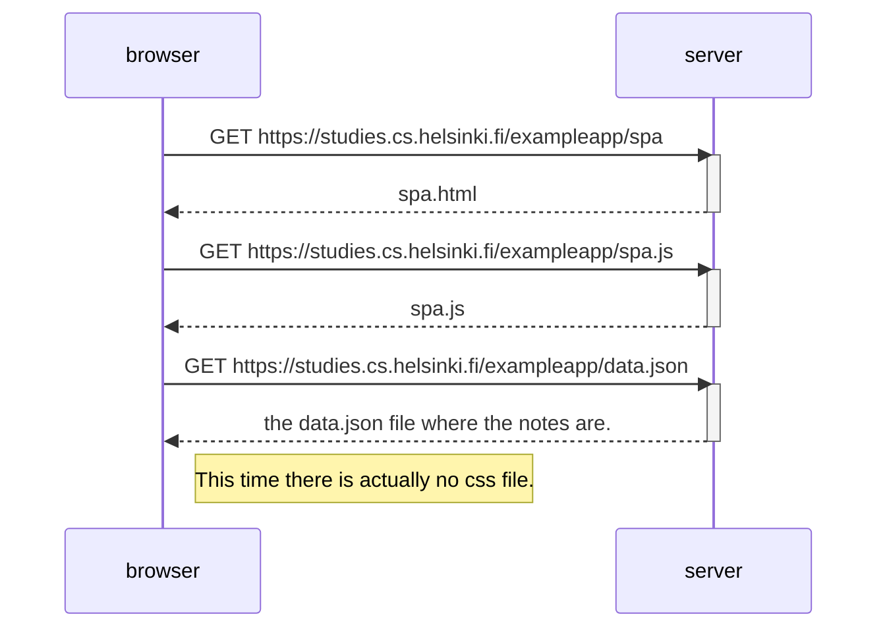
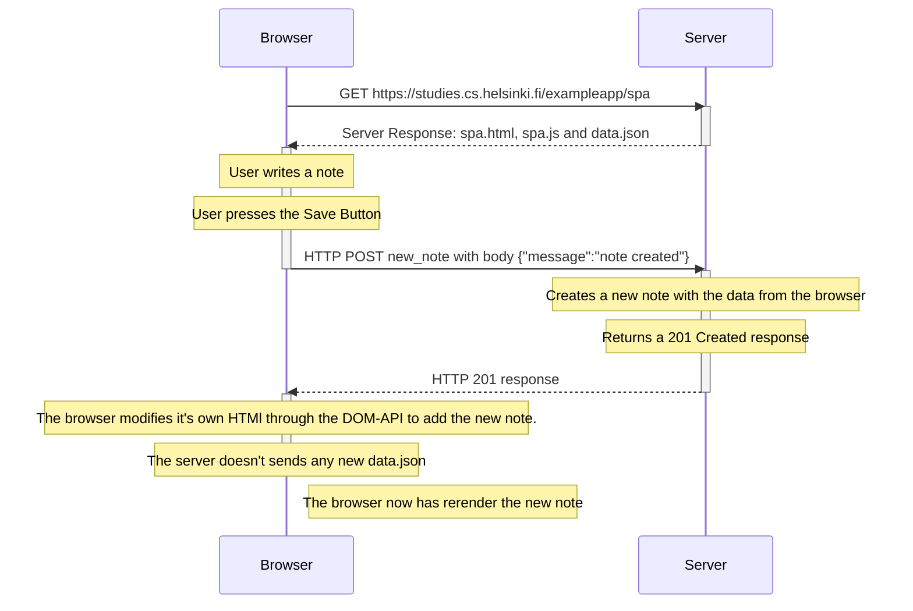

# Summary

So the main idea of this part is to start knowing more about how a browser and a server interacts with each other and how the exchange of information happens, diving into concepts like 'How request and responses works', 'What is the HTTP protocol used for', 'Chrome devtools used to debug', 'DOM-API', etc.

There is no need to write code in this part, You will only need to create a few sequence diagrams.

You can use any tool available, I will just the suggested one from the course, Mermaid on Markdown files.

Below i will put my answers, so if you don't want to be spoiled skip ahead.

If the next content isn't rendered right by github, you can use https://mermaid.live/ and see it online.

# 0.4

# 0.5

# 0.6

